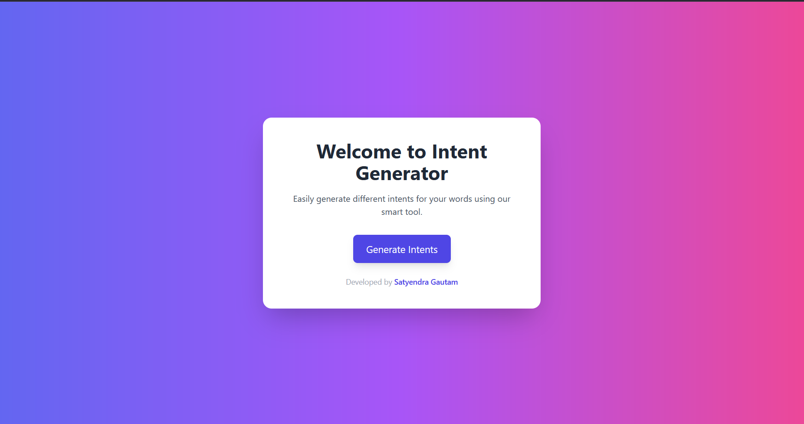

# 🚀 Intent Generator (Frontend + API Integration)

This project demonstrates a simple **Intent Generator App** that takes a single keyword as input and generates **7 different user intents** using an API (powered by Python/AI model).  
It is designed to showcase **frontend development, API integration, and backend deployment skills**.

---

## ✨ Features
-  User-friendly input box to enter a keyword  
-  Fetches intents dynamically from a Python API  
-  Clean and modern UI built with **Tailwind CSS**  
-  Demonstrates communication between **JavaScript frontend** and **Python backend API**  
-  Clear separation of frontend (`index.html`) and backend (`views.py and urls.py`)  

---

## 🛠️ Tech Stack
- **Frontend** → HTML, JavaScript, Tailwind CSS  
- **Backend** → Python (Django compatible)  
- **API Integration** → Fetch API in JavaScript  
- **Deployment Ready** → Easy to run locally or deploy on a server  

---
[]
## ⚙️ Installation & Setup

### 1. Clone the Repository
```bash
git clone https://github.com/satyendragautam901/intent_generator.git
cd intent-generator
```

### 2. Install Dependencies

### 3. Runserver
```
http://127.0.0.1:8000/ # go to this url 
```


